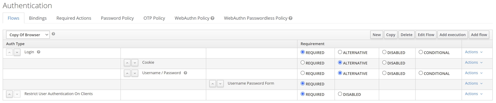
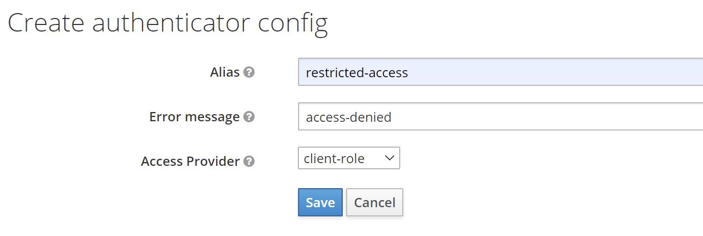
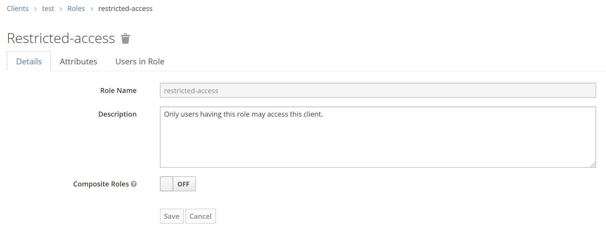
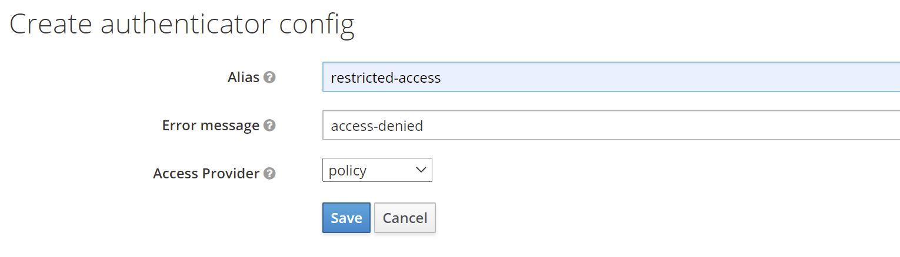
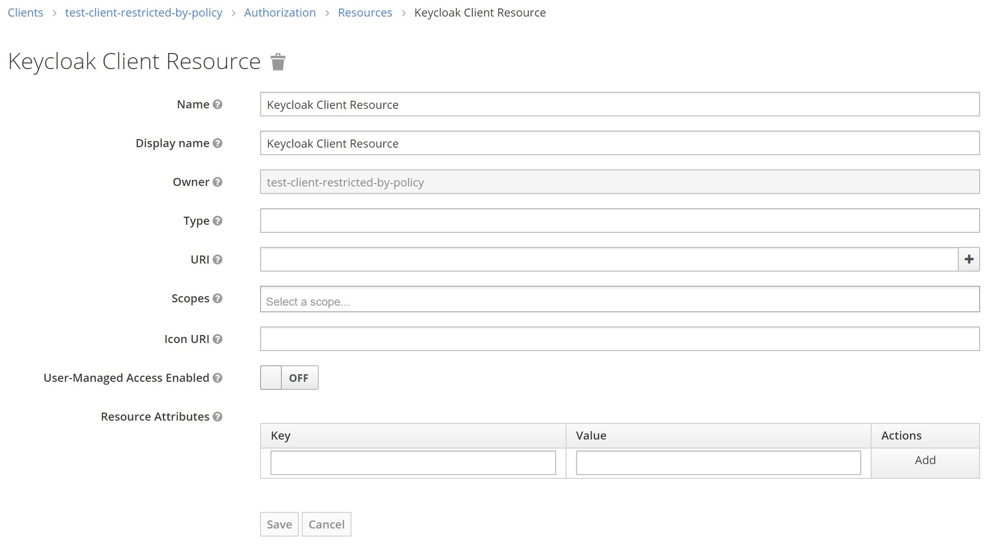
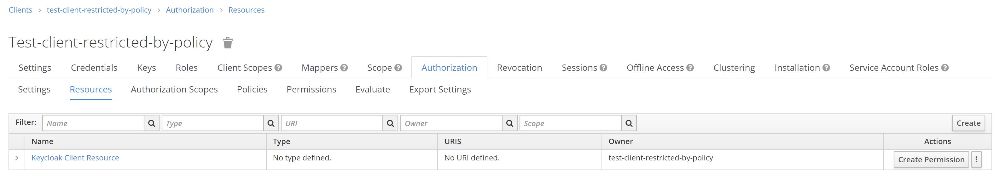
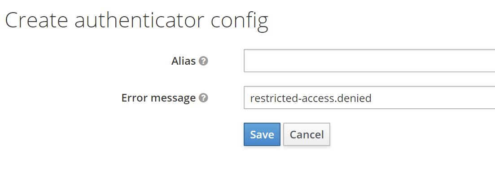
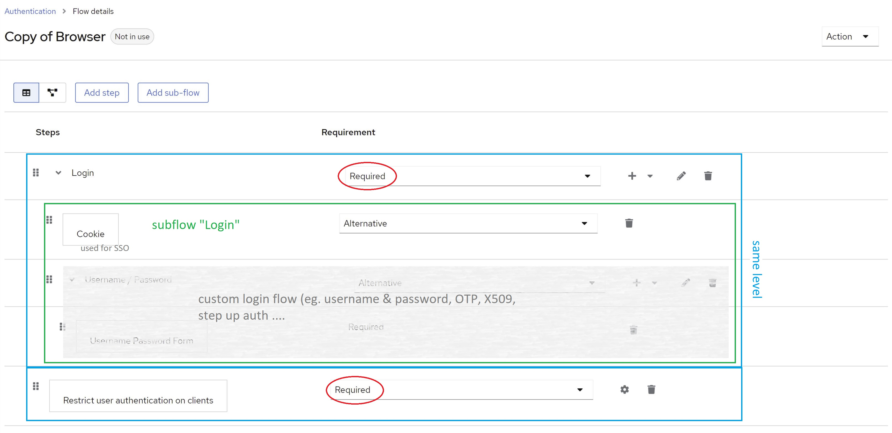

# Keycloak: Restrict user authorization on clients

This is a simple Keycloak authenticator to restrict user authorization on clients.


[](https://codescene.io/projects/25589)

## Quick introduction (Video interview with Niko Köbler)
[](https://www.youtube.com/watch?v=eQjOCrcit24)

## What is it good for?

As a Keycloak consultant, I often receive inquiries about restricting user authorization for specific clients. People commonly ask,

> Can I allow certain users to authenticate with a client while denying access to others?

While the answer used to be "no" for out-of-the-box Keycloak, I have developed this extension to meet this need.  but I recommend taking the time to understand the potential security implications before using this extension.

So, before using this extension, please take a moment to review the security considerations outlined in the  [security consideration](#security-considerations) section.

## How does it work?

The authenticator can work either role-based or policy-based.

### Role-based mode

In this mode, the authenticator uses client roles to restrict authentication. It works like this:

* The authenticator checks whether a client defines a role named `restricted-access`
    * If it does the authenticator checks whether the user has that role
        * If it does, the authenticator returns success (i.e. authentication is successful)
        * If it does not, the authenticator returns failure (i.e. authentication is unsuccessful)
    * If it does not, the authenticator returns success (i.e. authentication is successful).

This means that you can enable the authenticator on a per-client basis by adding a client role named `restricted-access` to your client.
A client with that role has the authenticator enabled. Only users with that role can authenticate to that client.

### Policy-based mode

In this mode, the authenticator uses client resources, permissions and policies to restrict authentication.
This mode only works for confidential OIDC clients with authorization enabled.
It works like this:

* The authenticator checks whether a client defines a resource named `Keycloak Client Resource`
    * If it does, the authenticator checks whether policies and permission evaluate to `PERMIT`
        * If it does, the authenticator returns success (i.e. authentication is successful)
        * If it does not, the authenticator returns failure (i.e. authentication is unsuccessful)
    * If it does not, the authenticator returns success (i.e. authentication is successful).

This means that you can enable the authenticator on a per-client basis by adding a resource named `Keycloak Client Resource` to your client.
A client with that resource has the authenticator enabled. Users will only be able to authenticate to such a client if the associated policies and permission permit access.

## How to install?

Download a release (*.jar file) that works with your Keycloak version from the [list of releases](https://github.com/sventorben/keycloak-restrict-client-auth/releases).
Follow the below instructions depending on your distribution and runtime environment.

### Standalone (without container)

Copy the jar to the `providers` folder and execute the following command:

```shell
${kc.home.dir}/bin/kc.sh build
```

### Container image (Docker)

For Docker-based setups mount or copy the jar to `/opt/keycloak/providers`.

If you are using RedHat SSO instead of Keycloak open source, mount or copy the jar to `/opt/eap/providers/`.

You may want to check [docker-compose.yml](docker-compose.yml) as an example.

### Maven/Gradle

Packages are being released to GitHub Packages. You find the coordinates [here](https://github.com/sventorben/keycloak-restrict-client-auth/packages/779937/versions)!

It may happen that I remove older packages without prior notice, because the storage is limited on the free tier.

## How to configure?

* Create a new flow per binding (e.g. browser flow, direct grant flow etc.)
* Add a sub-flow e.g. named `Login` and mark it as `Required`
* Add an authenticator execution `Restrict user authentication on clients` and mark the execution as `Required`.
* Within the `Login` sub-flow add authenticators/executions/conditionals and further sub-flows as needed (see [Keycload documentation for details](https://www.keycloak.org/docs/21.0.1/server_admin/#_authentication-flows)
* Then bind your newly created flow as desired - either as a default for the whole realm or on a per-client basis.

  See the image below for an example.


* Follow instructions below for the desired mode

> ⚠️ **User identity**:
>
> The authenticator needs a user identity to check whether the user has the desired role or not. Hence, ensure that you have steps/executions in your flow prior to this authenticator that can ensure user's identity.

### Client Role based mode

1) Configure the authenticator by clicking on `Actions -> Config` and select `client-role` as the `Access Provider`.

2) Add a role named `restricted-access` to the client you want to restrict access to.

   See the image below for an example.

3) Afterwards, no user can authenticate to this client. To allow a user to authenticate, assign the role `restricted-access` to the user. You may do so either by assigning the role to the user directly or via groups or combined roles.

#### Changing the role name

You do not like the role name `restricted-access` or you do have some kind of naming conventions in place? You can change the role name globally by configuring the provider.

```properties
spi-restrict-client-auth-access-provider-client-role-enabled=true
spi-restrict-client-auth-access-provider-client-role-client-role-name=custom-role
```

For details on SPI and provider configuration, please refer to [Configuring providers](https://www.keycloak.org/server/configuration-provider) guide.

### Resource Policy based mode

> ⚠️ **OIDC only**:
>
> Policy-based mode only works with OIDC clients (`Client Protocol` must be `openid-connect`)


1) Configure the authenticator by clicking on `Actions -> Config` and select `policy` as the `Access Provider`.

2) Configure the `Access Type` of the client to `confidential`
3) Set `Authorization Enabled` to `on`
4) Go to `Authorization -> Resources` and click `Create` to create a new resource
   
5) Set the `Name` and `Display name` to `Keycloak Client Resource` and keep the other fields blank
6) Save the resource
   
7) Click `Create Permission` to add permissions and policies (see [Authorization Services Guide](https://www.keycloak.org/docs/latest/authorization_services/#_permission_overview) for details)
8) Afterwards, no user can authenticate to this client unless permissions have been granted by configured policies.

### Using a custom error message

If a user tries to log in via a browser-based flow and access gets denied by the authenticator, a custom error message can be displayed.
In the flow choose the `Actions` button and then choose `Config`. You will see the following configuration screen.



You can directly define a particular message or use a property, which will be used for mapping the error message. If you choose a property, the property will be looked up from your custom theme's `messages*.properties` files and therefore supports internationalization.

```properties
# messages.properties
restricted-access.denied=Access denied. User is missing required role 'restricted-access'
# messages_de.properties
restricted-access.denied=Zugriff verweigert. Dem Benutzer fehlt die notwendige Rolle 'restricted-access'.
```

If the field is left blank, default property `access-denied` is used. In this case you do not need a custom theme, since this property comes with Keycloak out of the box.
For details on how to add custom messages to Keycloak, please refer to section [Messages and Internationalization](https://www.keycloak.org/docs/latest/server_development/#messages) in the server developer guide.

## Client Policy support

> ⚠️ **Feature preview**:
>
> Support for client policies is currently feature preview. I am happy to get some feedback on this.
> However, depending on feedback the feature may be changed  or even be removed again in the future.

Since version 18.1.0 this extension has basic built-in support for [client policies](https://www.keycloak.org/docs/latest/server_admin/#_client_policies).

### Conditions
This extension provides a [client policy condition](https://www.keycloak.org/docs/latest/server_admin/#condition) named `restrict-client-auth-enabled` to check whether user authentication on a client has been restricted or not.

### Executors
This extension provides a [client policy executor](https://www.keycfloak.org/docs/latest/server_admin/#executor) named `restrict-client-auth-auto-config` to automatically enable restricted access for clients. The executor can be cofigured to either enable restricted access based on resource policies or based on client role.

## Security considerations

### Policy enforcement
To avoid any confusion, it is important to note that this extension is not a policy enforcement point (PEP).
It does not enforce authorization decisions. It is part of making the authorization decision, but it does not enforce it.
Clients must enforce decisions being made.

According to the [OIDC specification/OpenID Connect Core 1.0 incorporating errata set 1](https://openid.net/specs/openid-connect-core-1_0.html#IDTokenValidation), it is the responsibility of the client to check the audience claims. Section 3.1.3.7. ID Token validation, point 3ff state that
> The Client MUST validate that the `aud` (audience) Claim contains its `client_id` value registered at the Issuer identified by the `iss` (issuer) Claim as an audience. [...]

And further it is very clear about the enforcement by the client:
> The ID Token MUST be rejected if the ID Token does not list the Client as a valid audience, or if it contains additional audiences not trusted by the Client.
> If the ID Token contains multiple audiences, the Client SHOULD verify that an `azp` Claim is present.
> If an `azp` (authorized party) Claim is present, the Client SHOULD verify that its client_id is the Claim Value.

So, by design this extension cannot be a PEP.

What this extension supports you with is authorization decision-making and communicating the outcome to the user during login flow. If configured correctly, it will prevent issuance of tokens that contain an audience or authorized party claim for a client that users do not have access to.

Token issuance or non-issuance is (beside claims in the token) just one way to communicate the outcome of authorization decision-making. It is not enforcement of the decision.

Make sure your clients enforce decisions correctly and ensure validation auf `aud` (audience) and `azp` (authorized party) claims.

If you are using a Keycloak adapter, make sure your clients are verifying the audience claim by enabling `verify-token-audience` in your [adapter config](https://www.keycloak.org/docs/latest/securing_apps/#_java_adapter_config).

### Protect all possible flows

Ensure that you protect access to your clients in all flows, not just the browser flow. Failure to do so may allow malicious users to obtain access or identity tokens via other flows.
Especially post login flows of identity providers and flows used in authentication flow overrides are often overlooked.

### Disable the `Audience Resolve` mapper if necessary
The [`Audience Resolve` protocol mapper](https://www.keycloak.org/docs/latest/server_admin/#_audience_resolve) is enabled by default by client scope `roles`, but it may be necessary to remove it in some cases.
Failing to set up audience claims correctly may result in a token containing the restricted client as an audience claim, even if the user does not have access to that client.

## Frequently asked questions

### Does it work with the legacy Wildfly-based Keycloak distro?
Maybe! There is even a high chance it will, since this extension does not make use of any Quarkus-related functionality.
For installation instructions, please refer to an [older version of this readme](https://github.com/sventorben/keycloak-restrict-client-auth/blob/v19.0.0/README.md).

Please note that with the release of Keycloak 20.0.0 the Wildfly-based distro is no longer supported.
Hence, I dropped support for the Wildfly-based distro already. Though this library may still work with the Wildfly-based distro, I will no longer put any efforts into keeping this extension compatible.

### Does it work with Keycloak version X.Y.Z?

If you are using Keycloak version `X` (e.g. `X.y.z`), version `X.b.c` should be compatible.
Keycloak SPIs are quite stable. So, there is a high chance this authenticator will work with other versions, too. Check the details of latest [build results](https://github.com/sventorben/keycloak-restrict-client-auth/actions/workflows/buildAndTest.yml) for an overview or simply give it a try.

Authenticator version `X.b.c` is compiled against Keycloak version `X.y.z`. For example, version `16.3.1` will be compiled against Keycloak version `16.y.z`.

I do not guarantee what version `a.b` or `y.z` will be. Neither do I backport features to older version, nor maintain any older versions of this authenticator. If you need the latest features or bugfixes for an older version, please fork this project or update your Keycloak instance. I recommend doing the latter on regular basis anyways.

### Why not use "Allow/Deny Access" authenticators with conditions?

With Keycloak 13 two new authenticators have been added, namely `Allow Access` and `Deny Access`. Together with `Condition - User Role` authenticator authentication may be restricted in a similar way with out-of-the-box features. So, the question is why not use that and override authentication flows on a per client basis?

Here are some reasons/thoughts
* It is not really flexible. Since `Condition - User Role` only allows for checking one concrete (realm or client-specific) role, a very complex flow handling all clients, or a totally separate flow for each individual client would be needed.
* It simply does not work well with federated authentication (ie. identity provider redirects), since there is no way to configure client specific behaviour for `First login flow` or `Post login flows`. In other words, there is no feature like `Authentication flow overrides` at an IdP level. Hence, the same flow will be used for all clients. As said before, this becomes very complicated.

### Getting error KC-SERVICES0013: Failed authentication

When getting an error or warning like this,
```
WARN  [org.keycloak.authentication.DefaultAuthenticationFlow] (default task-26) REQUIRED and ALTERNATIVE elements at same level! Those alternative executions will be ignored: [auth-cookie, identity-
provider-redirector, null]
WARN  [org.keycloak.services] (default task-26) KC-SERVICES0013: Failed authentication: org.keycloak.authentication.AuthenticationFlowException: authenticator: restrict-client-auth-authenticator
```

you have mostlikely mixed required and alternative subflows/steps/authenticators at the same level in your custom flow.
Keycloak does not support this.

Make sure you do not combine required and alternative authenticators at the same level.
See the following image for details:


